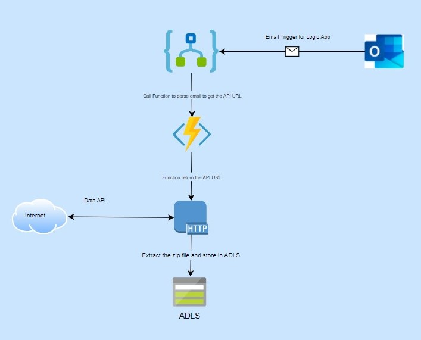

## PDF Converter - Bulk

### Summary

An service to download and extract data from an API endpoint received trough an email 

### Background

Customer needs to receive and download data from a  data provider on a daily basis.  The data provider sends an API endpoint URL with an access key to the customer in an email message.  

### Goal

Develop a solution to automate the process of downloading the data and when email arrives from the data provider.

### Proposed Solution

 - Trigger the Logic App on arrival of the specific email.
 
 - Read email with URL and send the email body to a Function App
 
 - Azure Function Extract URL(API endpoint) from email using
   HTML paarser and return thr URL.
   
 - Logic App  uses the URL in an HTTP request to download data and store the
   archive file in ADLS
   
 - Logic app extract the archive file(Unzip) and store the actual CSV file in ADLS
   for further processing.

